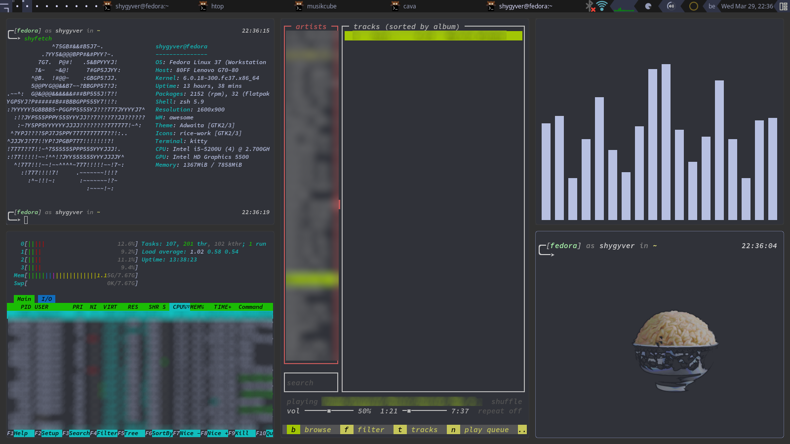

# awesomewm-dotfiles
My awesome wm config

  
Screenshots

### ricework

## Fonts
- [Hack Nerd Font](https://github.com/ryanoasis/nerd-fonts#option-3-install-script)
- [Vanilla Caramel](https://www.dafont.com/vanilla-caramel.font)
- [Purple Smile](https://www.dafont.com/purple-smile.font)