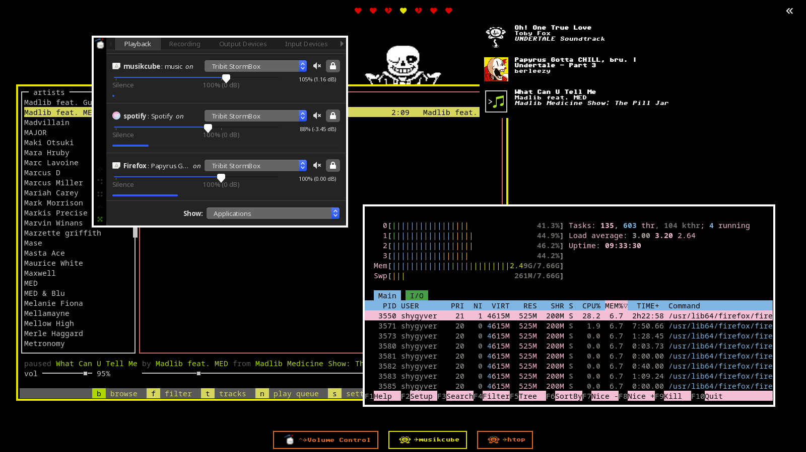

# awesomewm-dotfiles
My awesome wm config

<details>
  <summary>Screenshots</summary>

### ricework


### spywork


### yumework


### paperwork


### homework


### afterwork


### workless


### underwork


### clockwork


### waterwork


### fancywork


### rework


### bywork


### guesswork


### donkeywork


</details>

### Apps to install manually

- [Spotify](https://flathub.org/apps/details/com.spotify.Client)
- [spicetify](https://github.com/spicetify/spicetify-cli)
- [spicetify-themes](https://github.com/spicetify/spicetify-themes)

### Automation

Switching between themes can also change the theme of the following apps:

- [kitty](https://sw.kovidgoyal.net/kitty/)
- zsh:
  - [zthxxx/jovial](https://github.com/zthxxx/jovial)
  
  Update your file `~/.zshrc` to add the following line (after the line `source $ZSH/oh-my-zsh.sh`):
  ```sh
  source $HOME/.config/awesome/config/zshrc.conf
  ```
- spotify:
  - [spicetify-themes](https://github.com/spicetify/spicetify-themes)
- neovim:
  - [nvim dots](https://github.com/demingongo/nvim-config)
  
  Update the file `~/.config/nvim/theme.vim` to only have the following line:
  ```vim
  source $HOME/.config/awesome/config/nvim-theme.vim
  ```

## References

### Fonts
- [Hack Nerd Font](https://github.com/ryanoasis/nerd-fonts#option-3-install-script)
- [Commodore 64](https://www.dafont.com/commodore-64.font)
- [Vanilla Caramel](https://www.dafont.com/vanilla-caramel.font)
- [Purple Smile](https://www.dafont.com/purple-smile.font)
