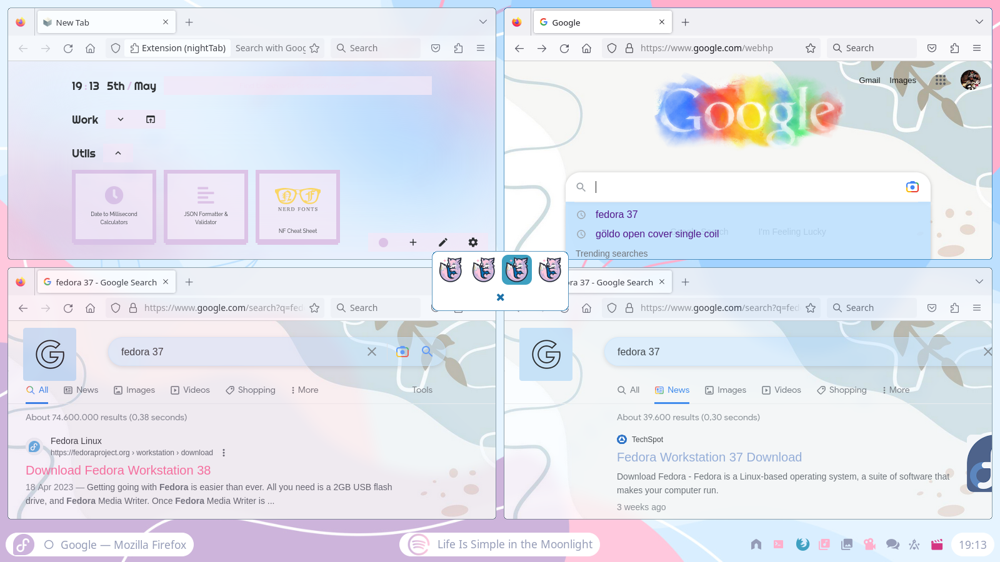

# awesomewm-dotfiles
My awesome wm config

  
Screenshots

### ricework

### spywork

### yumework

### paperwork

### homework

### afterwork

### workless

### underwork

### clockwork

### waterwork

### fancywork

### rework

### Apps to install manually

- [Spotify](https://flathub.org/apps/details/com.spotify.Client)
- [spicetify](https://github.com/spicetify/spicetify-cli)
- [spicetify-themes](https://github.com/spicetify/spicetify-themes)

### Automation

Each theme can update themes of the following applications:

(Todo: describe how to proceed to automate for each one)

- zsh:
  - [zthxxx/jovial](https://github.com/zthxxx/jovial)
- neovim:
  - [nvim dots](https://github.com/demingongo/nvim-config)
- spotify:
  - [spicetify-themes](https://github.com/spicetify/spicetify-themes)

## References

### Fonts
- [Hack Nerd Font](https://github.com/ryanoasis/nerd-fonts#option-3-install-script)
- [Commodore 64](https://www.dafont.com/commodore-64.font)
- [Vanilla Caramel](https://www.dafont.com/vanilla-caramel.font)
- [Purple Smile](https://www.dafont.com/purple-smile.font)
